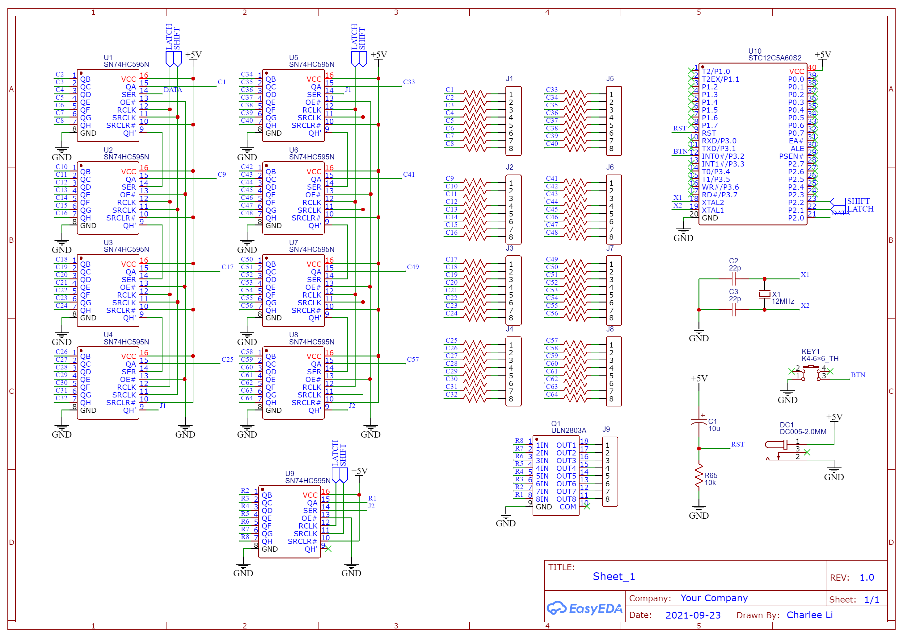

8x8x8 LED Cube
==============

A template is necessary to create the LED cube with the correct size. I created a template with a piece of MDF sheet.
The distance between rows and columns is 15mm.

Since my LEDs were not diffused, I sanded the tops with a rotary tool to prevent them from being too bright.
In order to solder them together, I bent the legs of the LEDs like this.

Layout the LEDs on the template.

Solder the LEDs. The bottom most row is a piece of 22AWG copper wire.

Now some layers were soldered together. In order to create a strong structure, adjacent layers should have different row/column configurations.

The completed LED cube.

Another thinner piece of MDF was used to create the base board. The distance between the holes is still 15mm.
Note that the hole should not be too small, it is very difficult to push 64 legs into 64 holes, so make the holes bigger to make your life easier.

Insert the legs into the holes.

Now secure the LED cube to the base board with hot glue.

I cut some dupont wires for connections.

Now the wires were soldered.

The controller used 9 [74HC595](https://www.ti.com/lit/gpn/sn74hc595) (one for the layers, eight for the 64 columns).
A 330Ω resistor was used for each column so that the current for each column is (5V - 3.3V) / 330Ω = 5mA.
This current does not go beyond the maximum ratings of each column 74HC595 (5mA per pin and 40mA for all pins, while the maximum ratings are 20mA per pin and 70mA for all pins),
but the total current for each layer (5mA * 64 = 320mA) goes way beyond the 20mA limit of the layer 74HC595.
In order to sink the 320mA current, an [ULN2803A](https://www.ti.com/lit/gpn/uln2803a) was used to provide a maximum 500mA sink ability.

At the center an STC12C5A60S2 with a 25MHz crystal was used.

The soldered controller board. 5V power is suppied through a micro USB port.

The back of the controller board.

The completed controller.

The cube assembled with the controller.

The cube running some animation.

